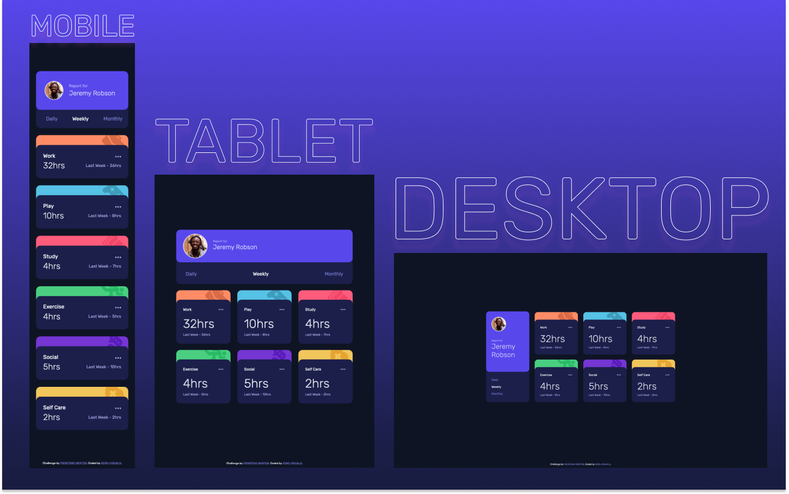

# Frontend Mentor - Time Tracking Dashboard Solution

This is a solution to the [Time Tracking Dashboard Challenge on Frontend Mentor](PROJECT LINK).

## Table of contents

- [Overview](#overview)
  - [The challenge](#the-challenge)
  - [Screenshot](#screenshot)
  - [Links](#links)
- [My process](#my-process)
  - [Built with](#built-with)
  - [What I learned](#what-i-learned)
  - [Continued development](#continued-development)
  - [Useful resources](#useful-resources)
- [Author](#author)

## Overview

### The challenge

Users should be able to:

- View the optimal layout for the site depending on their device's screen size
- See hover states for all interactive elements on the page
- Switch between viewing Daily, Weekly, and Monthly stats

### Screenshot



### Links

- Live Site URL: [https://kens-visuals.github.io/time-tracking-dashboard/](https://kens-visuals.github.io/time-tracking-dashboard/)
- Solution URL: [TO_BE_UPDATED](TO_BE_UPDATED)

## My process

### Built with

- Semantic HTML5 markup
- SCSS custom properties
- CSS Flexbox
- CSS Grid
- Vanilla JS
- Mobile-first workflow

### What I learned

First project in _JUNIOR_ category and I’m really excited to be back. This was a special project for me because it introduced me to `async/await`. I was expecting `async/await` to be a lot harder, but it was foolish of me 😂 It’s not the easiest thing, but as soon as you grasp the concept you’ll want to work with it more and more. It’s definitely easier to work with than `callback hell`. I don’t know if it’s just me, but whenever I see how something was really hard or frustrating to do and how easy, with the development of technologies it has become now, it makes me really happy 🤩 I added some animations to spice things up, and from now on I’m going to practice such things more and more. All in all, cool small project to practice `async/await` and `CSS Grid`. However, I’m looking forward to working with real `API`s. As always, if you have any feedback, leave your suggestions in the comments' section 👨🏻‍💻 Cheers 👾

```js
const getData = async function () {
  try {
    const data = await fetch(
      "https://raw.githubusercontent.com/kens-visuals/time-tracking-dashboard/main/javascript/data.json"
    );
    return await data.json();
  } catch (error) {
    console.error(`❌ ${error.message} ❌`);
  }
};
```

Just to clarify, I used local `data.json` file to build the app, but when I deployed it to GitHub Pages I got some errors. That's why I'm using the link you see above instead of just `data.json` file. And since there's no user interaction for error message, I didn't add much 🙃

### Continued development

I definitely want to work with animations more, initially I wanted to trigger an animation every time a user changed between the data. But I started to work on a different project and ever since didn't have much time to add that feature, but I'll come back to it some time later when I've got more practice with animations and transitions.

### Useful resources

- [Reference: ASYNC/AWAIT](https://javascript.info/async-await) - Since JS doesn't have an official documentation, I usually reference this website.
- [keyframes.app](https://keyframes.app) - If you want to create some complex animations and visualize them at the same time, this is the best choice.
- [animista.net](https://animista.net/) - In case of simeple animations, you can use animista, it provides a lot of options, as well as already prefixed version of the code.

## Author

- Frontend Mentor - [@kens-visuals](https://www.frontendmentor.io/profile/kens-visuals)
- Codewars - [@kens_visuals](https://www.codewars.com/users/kens_visuals)
- CodePen - [@kens-visuals](https://codepen.io/kens-visuals)
